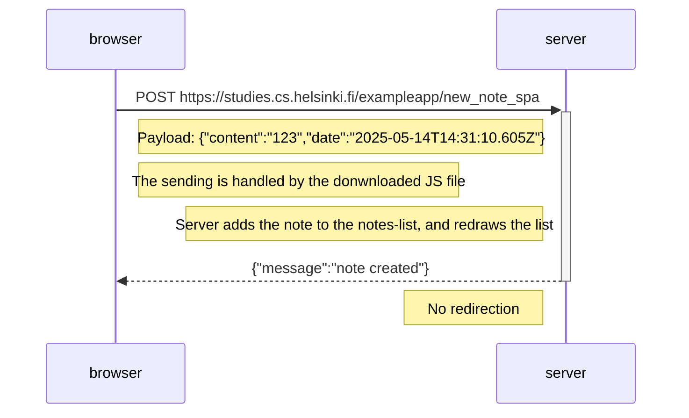

```mermaid

sequenceDiagram
    participant browser
    participant server

    browser->>+server: POST https://studies.cs.helsinki.fi/exampleapp/new_note_spa
    note right of browser: Payload: {"content":"123","date":"2025-05-14T14:31:10.605Z"}
    note right of browser: The sending is handled by the donwnloaded JS file
    
    note left of server: Server adds the note to the notes-list, and redraws the list
    server-->>-browser: {"message":"note created"}
    note left of server: No redirection

```